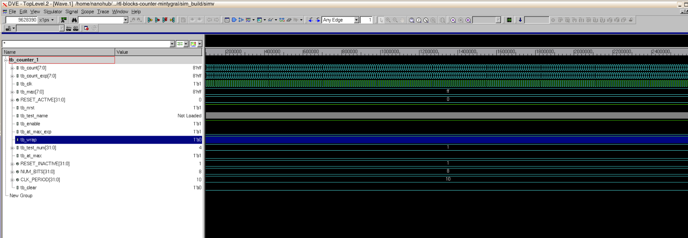
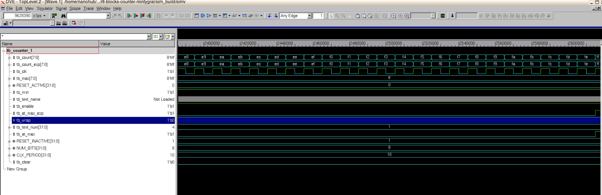
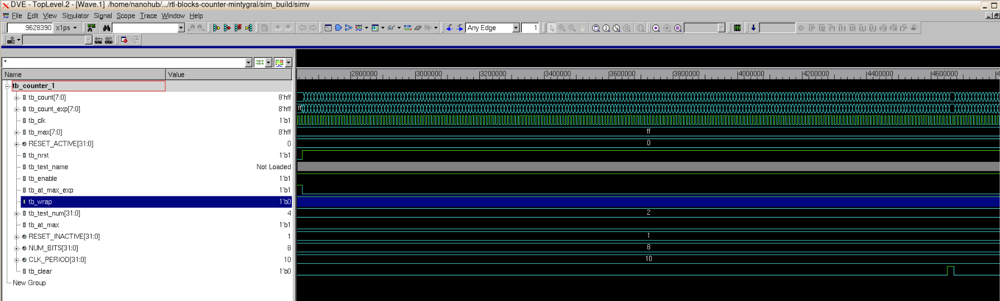
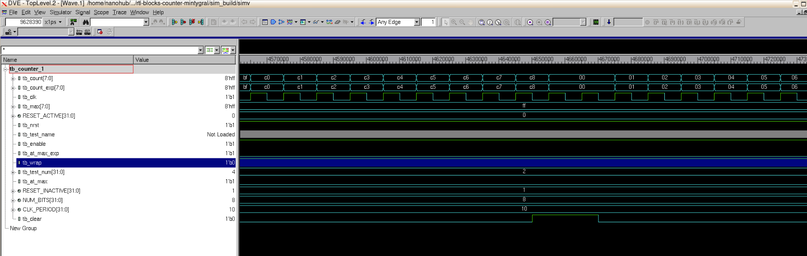
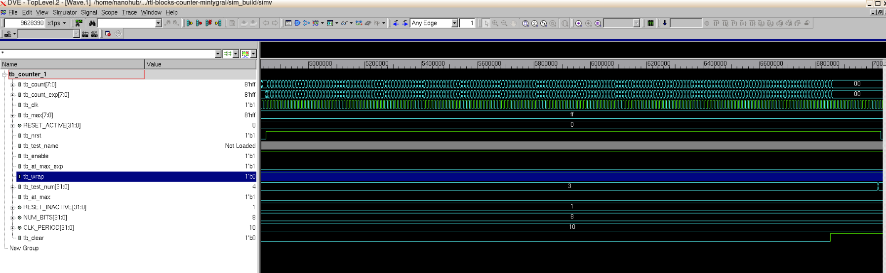
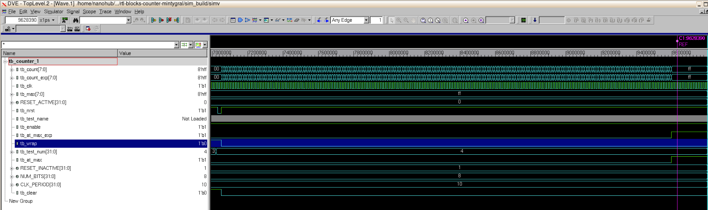

# Test Results

- ### 0: Power on and Reset

  

- ### 1: Continuous Counting
  
  For this test, the counter kept counting from 0-255 with no interruption.
  

  
  In the end it can be seen that the counter goes to 8'hFF which is the max value, so at_max = 1.

- ### 2: Discontinuous counting
  
  In this test, clear was set to high in the middle of counting, and then reset to 0. This shows how the counter keeps counting even when it has been interrupted. The same would happen if enable was set to low then high.

  
  
  
  
- ### 3: Clear priority
  
  In this test, clear is set to high and never reset to 0. Therefore the counter stays at 0, even though enable is high. This shows how clear has priority.

  

- ### 4: Wrap = 0
  
  In this test, wrap is set to 0, so when the coutner reaches the max value, it should hold it.
  
