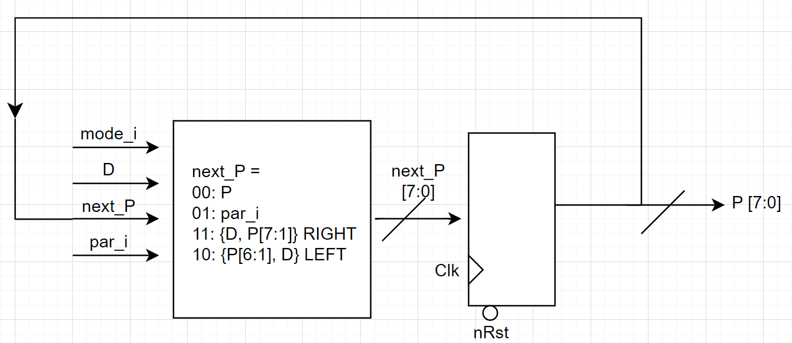
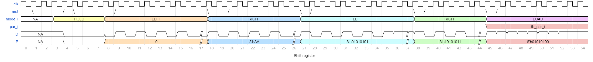

# Log

### RTL Diagram

### Wavedrom

### Overall waveform

### Test case 1: power on and reset

### Test case 2: Hold mode

### Test case 3: Left stream

### Test case 4: Right stream

### Test case 5: Left stream 10 bits

### Test case 6: Right stream 6 bits

### Test case 7: LOAD mode

