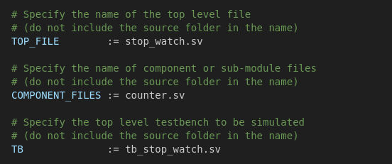
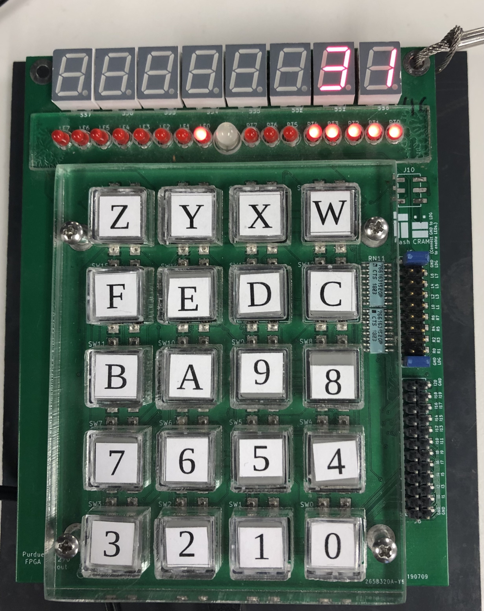

# Stop Watch

## Specifications

* Module name: `stop_watch`

* Module Inputs:
  - `logic clk` 
  - `logic nRst_i`
  - `logic button_i`

* Module Ouputs:
  - `logic [2:0] mode_o`
  - `logic [4:0] time_o`


The clock provided to your module will be a `100 Hz` clock. 

The nRst_i signal is an active low asynchronous reset to all the FFs in your design. 

The mode_o output needs to be 3'b100 when the state of the stop watch is IDLE, 3'b010 when the state is CLEAR, and 3'b001 when the state is RUNNING. 

The time_o output needs to count from 0 (5'b00000) to 31 (5'b11111) and wrap up around back to 0. 

Button inputs need to be passed through a synchronizer of depth 2, and an edge detector.

## Behavior

Each button press should change the state of the stop watch from IDLE to CLEAR to RUNNING, and back to IDLE again. 


- When the state of the stop watch is IDLE the time_o value should not change.

- When the state of the stop watch is CLEAR the time_o value should be cleared to 0. 

- When the state of the stop watch is RUNNING, the time_o value should increment by every second and wrap around to the value 0.


## Instructions

1. Clone the repo from GitHub.
2. Run `make setup` to configure directory for the project.
3. Prepare an RTL diagram and FSM state transition diagram for your stop_watch module and have it approved by a TA.
4. Prepare a timing diagram using wavedrom that illustrates the operation of your stop watch module and have it approved by a TA. 
5. Implement your stop_watch module and other supporting modules you need in their own **separate** files. Each block in your top level design should be in its own "module-name".sv file where "module-name" is the name of the module contained in the file. Below is an example of what your Makefile should look like if stop_watch.sv is used as the top level file, counter.sv is used as a component file, and tb_stop_watch.sv is used as the test bench file:

<br>

      

<br>

6. Run `make help`/`make` to see the make file targets.
7. Verify your design by adding test cases in the test bench code.
8. Have a TA review your test cases and simulation waveforms.
9. Implement the design on the FPGA. 

## Verification Requirements
A starter test bench file `tb_stop_watch.sv` has been provided. It contains some tasks that may be useful. Feel free to create your own tasks or modify the ones provided. In order to be checked off by a TA, you must have the following minimum test cases in your test bench:
- Power-on-reset sequence
- Iterating through different modes
- Pressing button for many clock cycles to verify mode changes only once per button press
- When mode is RUNNING, verify time_o increments every second
- Verify time_o stops changing after stop watch returns to IDLE
- Verify count clears when mode transitions to CLEAR

## Implementation on the FPGA

To implement your design on the FPGA, instantiate it within the top module in top.sv.

Make the following connections in the top module:
   - Connect the clk input to hz100 (this is the 100 Hz clk of the FPGA)
   - Connect nRst_i to ~pb[19].
   - Connect button_i to pb[0]. 
   - Connect time_o to right[4:0].
   - Connect mode_o to left[2:0].

After you have made all the connections and instantiated your stop watch module, you can flash you design to the FPGA by typing the following command in your LAB machine's terminal: 
   ```bash
      make ice
   ```

Demo your design to a peer mentor.

NOTE: Keep stop_watch.sv as the "TOP_FILE" variable in the Makefile. **DO NOT** add top.sv to any of the TOP_FILE, COMPONENT_FILES, or TB variables.


## Optional Tasks

If you have time, try to display the time_o value in decimal to the seven segment displays on the FPGA. 

You will probably need to write a few extra modules. 

The final output should be something like this when the stop watch is running:


